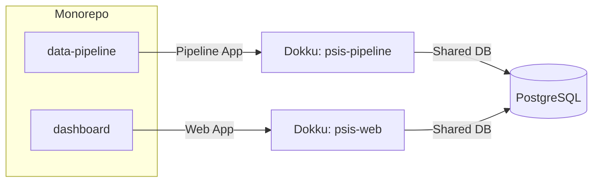

# 🎓 Canadian Higher Ed: Regional Specialization Dashboard

**End-to-End Data Stack for University Program Analysis**

## 📖 Overview
Analyze Canadian university program specializations by calculating **Location Quotients (LQ)** from Statistics Canada PSIS data. The stack transforms raw data into an interactive dashboard for university administrators.

---

## 🏗 System Architecture

```mermaid
flowchart TD
	A[Raw StatCan PSIS Data] --> B[Python Ingestion (dlt)]
	B --> C[PostgreSQL Storage]
	C --> D[dbt Transformation]
	D --> E[PHP API]
	E --> F[Chart.js Dashboard]
```

---

## 📦 Repository Structure

```text
.
├── dashboard/        # PHP Web Application
│   ├── api/         # PHP Data API
│   ├── index.php    # Dashboard UI
│   └── assets/      # JS (Chart.js) & CSS
├── data-pipeline/   # Data Engineering
│   ├── dlt_loader.py
│   ├── dbt_transform/
│   ├── Dockerfile
│   └── requirements.txt
└── README.md
```

---

## 🚀 Deployment Workflow (Dokku)



---


### 1. Database Setup
```bash
dokku postgres:create psis-db
```

### 2. App Orchestration
```bash
# Link apps to shared DB
dokku postgres:link psis-db psis-web
dokku postgres:link psis-db psis-pipeline

# Set subfolder contexts
dokku config:set psis-web APP_CONTEXT=dashboard
dokku config:set psis-pipeline APP_CONTEXT=data-pipeline
```

---


## 📊 Location Quotient Logic

The **Location Quotient (LQ)** is calculated in dbt:

- **LQ > 1.2:** Regional Specialization (Green)
- **LQ < 0.8:** Under-represented Field (Blue)

---


## 🛠 Setup & Installation

### Prerequisites
- Python 3.10+
- PHP 8.x
- PostgreSQL

### Local Development
1. Clone repo: `git clone https://github.com/your-username/psis-specialization.git`
2. Run pipeline:
	```bash
	cd data-pipeline
	pip install -r requirements.txt
	python dlt_loader.py
	cd dbt_transform && dbt run
	```
3. Launch dashboard:
	Point your PHP server to `/dashboard`.

---


## 📝 Technical Highlights

- **Data Integrity:** dbt tests (unique, not_null) prevent double-counting of "Total" rows.
- **Performance:** dbt Ephemeral & Incremental models optimize large dataset transformations.
- **DevOps:** Automated deployment via Git hooks; containerized Python for reproducibility.